## Amazon Connect

Amazon Connect 是云原生的智能呼叫中心服务，它按用户的使用量（电话呼入的时间、以及处理的消息数）进行付费，能够在一天之内搭建客户服务中心，并实现智能流程，所以是企业接入用户的一个非常好的选择。

Amazon Connect 支持集中用户认证，1) 内置的用户系统 2) Active Directory 3) 基于SAML2.0 的认证服务器。

如果客户想要在自己的CRM系统，或者客服工作台使用 Amazon Connect，就需要使用 AD 或，基于SAML2.0 的认证服务器，来实现与现有系统的单点登录（SSO）。

在本文中，我们将介绍如何使用 Keycloak 作为认证服务，通过 SAML 协议为 Amazon Connect 提供单点登录功能。

如果想要使用 Okta、Azure AD 等认证服务器，请参考 [Amazon Connect SSO Setup Workshop](https://catalog.workshops.aws/amazon-connect-sso/en-US)。

## Keycloak 与 SAML

### Keycloak

Keycloak 是一款开源的身份与访问控制软件，提供单点登录 (SSO) 功能，支持 OpenID、 OAuth 2.0、SAML 2.0 等标准协议。Keycloak 提供可自定义的用户界面，用于登录、注册和账户管理等。而且，客户可以使用 Keycloak 并将身份验证委派给现有的 LDAP 和 Azure Active Directory，或第三方身份提供商，实现灵活的认证服务。

### SAML 2.0 协议

SAML，即安全断言标记语言（Security Assertion Markup Language）是一个基于 XML 的开源标准数据格式，通过在各方之间交换身份验证和授权数据，实现跨域的单点登录。

SAML协议中，包含两个主体：
 * Identity Provider 身份提供方，简称 IdP。即通常说的认证服务器，它保存用户及密码等信息，为用户提供登录服务，并在登录成功后为服务提供方提供身份断言（ID Assertion），即标识某个人身份的Token。
 * Service Provider 服务提供方，简称 SP。即通常所说的应用，如 CRM 系统等，用户在身份提供方登录成功后，会跳转到应用界面进行操作。

两个主体通过浏览器进行信息交换，例如使用带有参数的重定向请求，下图就是 SAML 2.0 协议中，身份提供方、服务提供方、和浏览器进行身份验证的流程：


sequenceDiagram
    participant SP
    participant Browser
    participant IdP
    Browser->>SP: 访问服务
    SP->>SP: 生成 SAML Request
    SP->>Browser: 携带 SAML Request, 重定向到IdP的登录地址
    Browser->>IdP: 携带 SAML Request, 访问IdP的登录地址
    IdP->>IdP: 解析 SAML Request
    IdP->>Browser: 返回登录页面
    Browser->>IdP: 用户登录
    IdP->>IdP: 登录成功，生成SAML Response
    IdP->>Browser: 携带SAML Response，重定向到SP的ACS地址
    Browser->>SP: 携带SAML Response，访问SP的ACS地址
    SP->>SP: 检验SAML Response
    SP->>Browser: 检验成功
    Browser->>SP: 重定向到RelayState页面


在本文中，Keycloak就是IdP，而 Amazon Connect 就是其中一个SP。

### SP 与 IdP 之间通信方式

SP 与 IdP 之间有几种通信方式，"HTTP Redirect Binding"，"HTTP Post Binding" 和 "HTTP Artifact Binding
"。

#### HTTP Redirect Binding

其中，HTTP Redirect Binding 很好理解，就是说浏览器在SP 和 IdP直接跳转的时候，是通过 HTTP 的重定向请求进行的。例如在访问 SP 时，重定向到 IdP 进行登录：


sequenceDiagram
    participant SP
    participant Browser
    participant IdP
    Browser->>SP: 访问服务
    SP->>SP: 生成 SAML Request
    SP->>Browser: 将 SAML Request 放在URL中, 重定向到IdP的登录URL
    Browser->>IdP: 访问IdP的登录地址


由于 SAML Request 要放在 URL 地址中进行重定向，所以会收到长度的限制，也存在一些泄漏风险。

#### HTTP Post Binding

而 Post Binding 就是通过一个 POST 请求来实现，其流程如下：


sequenceDiagram
    participant SP
    participant Browser
    participant IdP
    Browser->>SP: 访问服务
    SP->>SP: 生成 SAML Request
    SP->>Browser: 返回一个由JS控制的Form表单
    Browser->>IdP: 浏览器往 IdP 提交该表单（POST请求）


在之后登录成功后，IdP 也是返回一个由JS控制的Form表单，而这个请求则发到 SP 的ACS 地址上。

由于使用 POST 请求，所以其大小相对于 URL 来说不受限制，而且也比较安全。Keycloak中使用的也是这种绑定方式。

#### HTTP Artifact Binding

在这种方式下，SP 和 IdP 双方只通过浏览器交换 SAML Request 和 Response 的编号，收到编号后，都需要再请求对方的相应接口，来获得其真正内容，从而完全避免这些数据暴露在浏览器端。

## 配置 Amazon Connect

理解了 SAML 的原理，我们再来看如何为 Amazon Connect 配置 SAML 以及 Keycloak 来实现单点登录。

通常情况下，我们通过 SAML 访问服务，有以下两种方式：
1. 直接访问 SP 的应用地址，应用检测到没有登录，就跳转到 IdP 的登录页面，登录成功后跳转回来。但是在 Amazon Connect 中，我们无法设置 Idp 地址，如果我们直接打开 Amazon Connect 的地址，将会显示如下的错误页面。

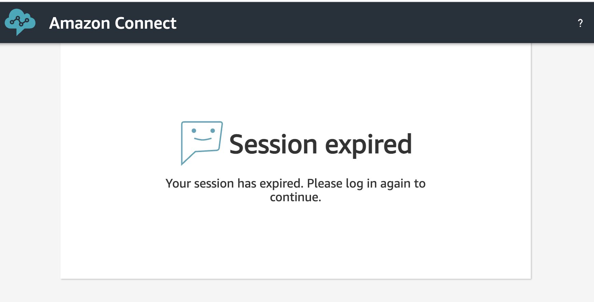

2. 通过 IdP 的 "IDP initiated SSO URL" 访问应用，它会检查是否登录，然后在登录成功后，跳转到设置的 "IDP Initiated SSO Relay State " 地址。所以，在配置成功 SAML 以后，我们将使用这种方式访问。

结合上面的 SAML 的流程，在 Amazon Connect 和 Keycloak 使用 SAML 进行登录的过程如下：


sequenceDiagram
    participant Browser
    participant IdP SSO URL
    participant IdP SSO Login URL
    participant IdP SSO Relay State
    participant SP (ACS URL)
    participant SP (Amazon Connect)
    Browser->>IdP SSO URL: 访问IdP SSO URL
    IdP SSO URL->>Browser: 重定向到登录页
    Browser->>IdP SSO Login URL: 访问登录页
    IdP SSO Login URL->>IdP SSO Login URL: 登录成功，生成SAML Response
    IdP SSO Login URL->>Browser: 携带SAML Response，重定向到SP的ACS地址
    Browser->>SP (ACS URL): 携带SAML Response，访问SP的ACS地址
    SP (ACS URL)->>SP (ACS URL): 检验SAML Response
    SP (ACS URL)->>Browser: 检验成功, 重定向到 IdP SSO Relay State 地址
    Browser->>IdP SSO Relay State: 访问IdP的 Relay State 地址
    IdP SSO Relay State->>Browser: 重定向到 Connect 页面
    Browser->>SP (Amazon Connect): 访问 Connect 页面


上图中：
 * IdP SSO URL: 即 IDP-Initiated SSO URL，是通过 IdP 发起的，用于访问服务地址。它是在 Keycloak 中创建Client时设置。
 * IdP SSO Login URL: 即 IdP 的单点登录地址。一般无需设置。
 * SP (ACS URL): 由 SP 提供的用于检验 SAML Response 的接口，在 AWS 中，该地址是固定的，需要在 Keycloak 设置。
 * IdP SSO Relay State: 是登录成功后，需要跳转到应用时的 URL。在 AP ACS 检验 SAML Response 成功后，携带身份信息跳转到该 URL，相对于应用的 SAML SSO 入口。在我们这里，如果不设置该 URL，就会跳转到 AWS Console页面。
 

所以，大致步骤如下：
1. 创建使用 SAML 的 Amazon Connect 实例。
2. 在 Keycloak 上配置 Amazon Connect 的Client，并进行 SAML 相关配置。
3. 在 Amazon IAM 中创建该 Keycloak 为身份提供商，并创建角色，所有通过 Keycloak 认证的用户都通过该角色来访问 Connect 服务。

### 安装 Keycloak

安装 Keycloak 不在本文的范围内，如果去 Keycloak 官网进行下载安装。

在本文中，我[下载 ZIP 包在本地运行 Keycloak](https://www.keycloak.org/getting-started/getting-started-zip)。本地访问地址是：[http://localhost:8080/](http://localhost:8080/)。本文所使用的 Keycloak 版本是 *19.0.3*，如果您所使用的版本与这个不一样，可能有部分配置不一样。

您需要创建 admin 账户，如果需要，创建新的 realm，名称为 AWSDemo：


### 创建 Amazon Connect
首先，我们需要创建 Amazon Connect 实例，并且选择 "SAML 2.0-based authentication"。

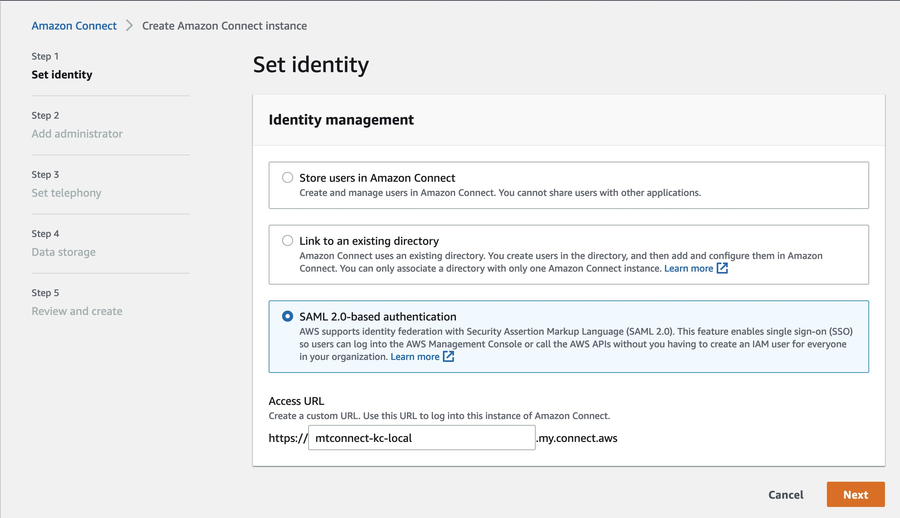

第二步需要创建Admin，这里的 *Username* 就是以Admin来登录 Amazon Connect 的用户名，这里是 "mavlarn"，而这个用户名必须要跟之后要在 Keycloak 里面创建的用户名完全一致。

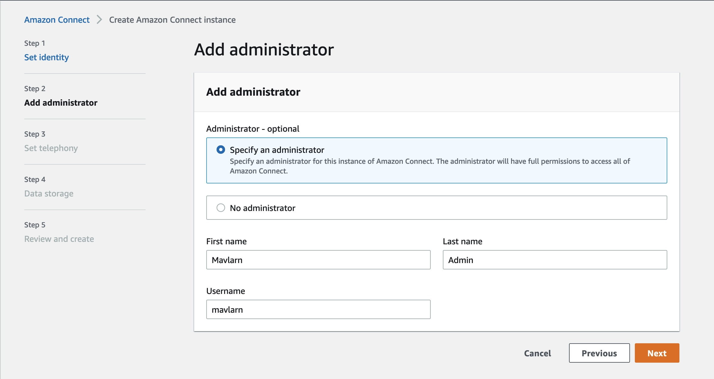

> 由于我们使用 SAML 认证，所以这里不需要设置该用户的密码，这里只是告诉 Connect，Keycloak 里面的用户 "mavlarn"，将作为 Amazon Connect 系统的管理员。

后续的步骤，跟其他方式创建 Connect 实例没什么区别，最后创建以后，等1，2分钟，实例就会创建完成。创建成功后，打开实例详情，找到该实例的 ID：

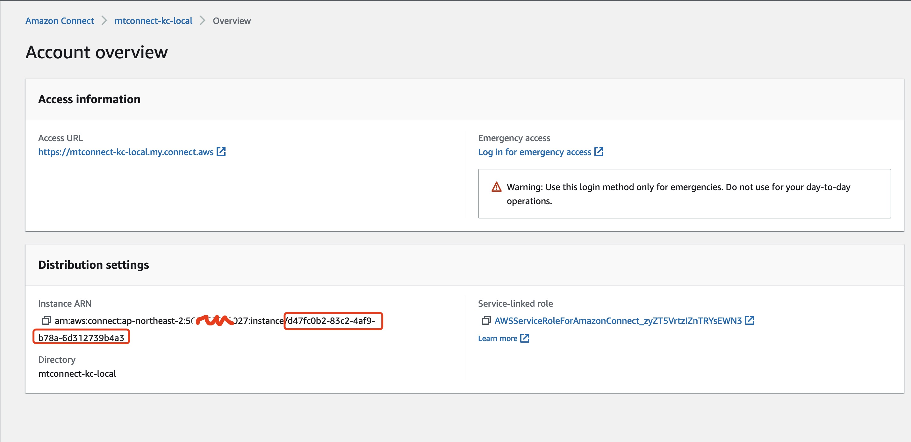

ARN 中，最后的一串横线隔开的数字 *d47fc0b2-83c2-4af9-b78a-6d312739b4a3* 就是实例 ID。记下该 ID 备用。

### 为 Amazon Connect 与 Keycloak 配置 SAML
接下来，在 Keycloak 中创建 Client，来作为 Amazon Connect 的认证客户端。

#### 为 Amazon Connect 创建Client

首先，下载 AWS 提供的 [saml-metadata.xml](https://signin.aws.amazon.com/static/saml-metadata.xml)文件，然后在 Keycloak 系统中确保选择了合适的Realm，然后点击 Clients 页面中的 "Import client" 按钮，打开页面：


点 "Browser" 按钮，上传刚才下载的文件，输入Name 和 Description，由于这个Client是为 Connect 提供 SSO 的，所以这里的 Name 为 aws_connect，可以根据需要输入自己的名称。

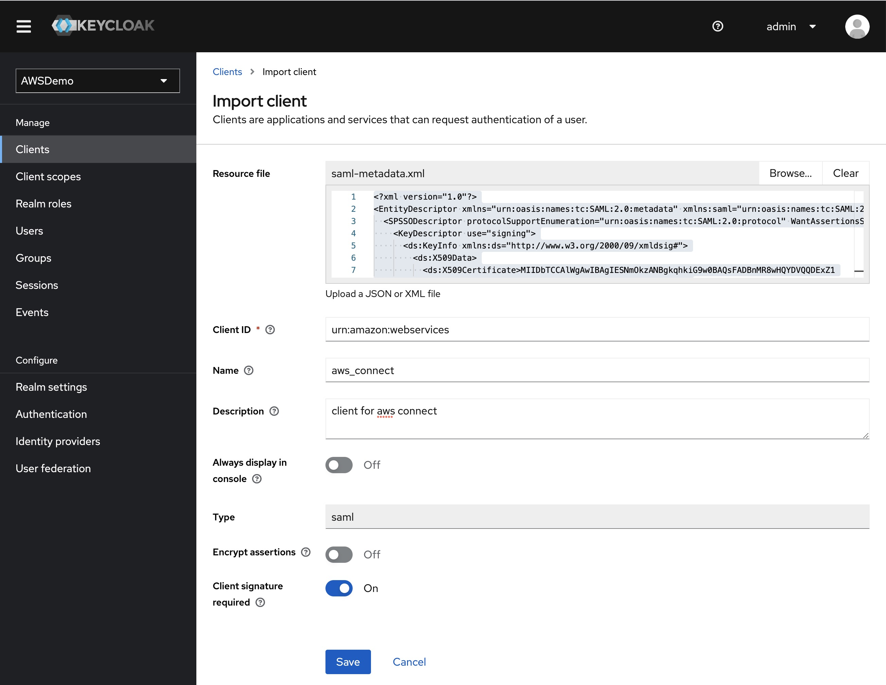

保存后，进入详情页，设置以下几项：
 * IDP-Initiated SSO URL name: 输入 aws_connect，输入后，下面就会显示出：Target IDP initiated SSO URL: *http://localhost:8080/realms/AWSDemo/protocol/saml/clients/aws_connect*，这就是我们用来访问 Amazon Connect 时的入口 URL。

 * IDP Initiated SSO Relay State: 输入 *https://ap-northeast-2.console.aws.amazon.com/connect/federate/d47fc0b2-83c2-4af9-b78a-6d312739b4a3*。这个地址是 Amazon Connect 的SAML URL，其中 *ap-northeast-2* 是我创建 Connect 的区域，如果您的 Connect 创建到了不同的区域，请进行修改。这个 URL 最后的 *d47fc0b2-83c2-4af9-b78a-6d312739b4a3* 是我们创建的 Connect 实例 ID，是在上面创建完成后，从 ARN 中得到的。

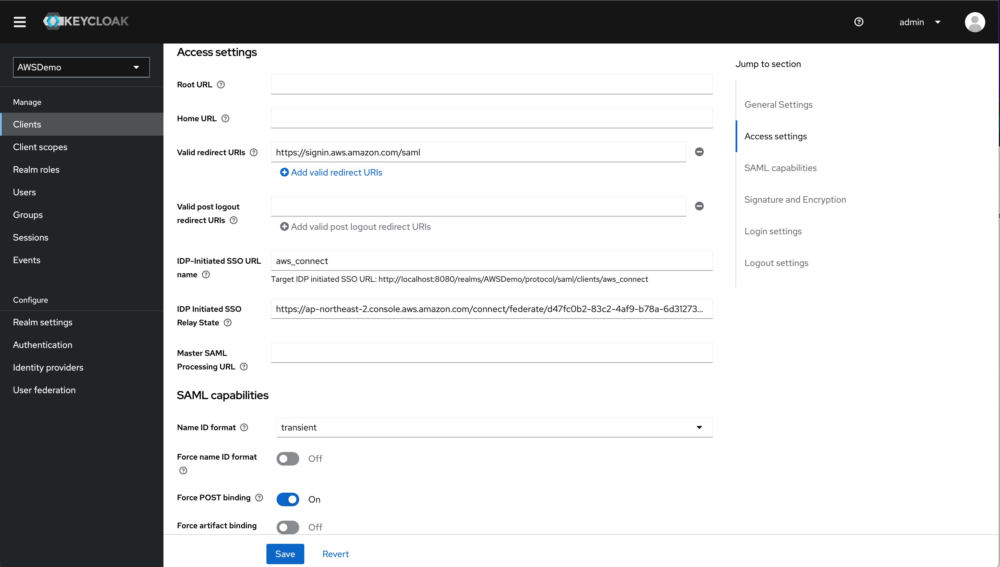

> 在 Client 详情页中的 "Advanced" tab 页，有一个 **Assertion Consumer Service POST Binding URL** 设置，它就是 AWS 的 ACS(Assertion Consumer Service) 地址，导入 AWS saml-metadata.xml 文件创建 Client 时，这个值被设置成 *https://signin.aws.amazon.com/saml*。Keycloak 登录完成后，会携带 SAML Response，跳转到该地址，交给 AWS 进行验证，验证成功以后，再跳转到上面配置的 *IDP Initiated SSO Relay State* 配置的URL，从而访问 Connect 页面。

#### Client 配置修改

我们使用从 AWS 下载的 saml-metadata.xml 文件，导入生成了 Client，但是这个客户端的部分配置还需要修改。进入新建的客户端的详情页，进入 *Client scopes* tab 页：

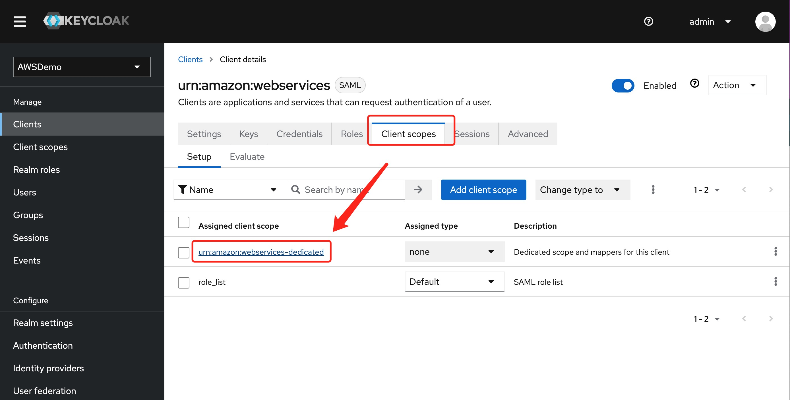

点击 *urn:amazon:webservices-dedicated* 进入后，在搜索框输入 *Role* 搜索，会看到有两个 mapper 配置：

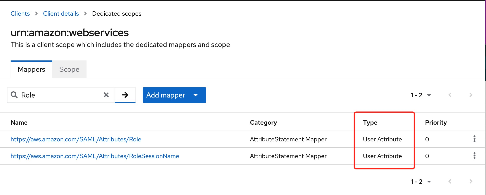

看到他们的类型（Type，也就是映射类型）都是 *User Attribute* ，这是不对的，使用这种类型，就无法正确的映射角色，所以我们删除这两个mapper，重新创建。

点击 *Add mapper*，选 *By Configuration* ，从弹出的页面中，选择 *Role list*：


按照下面输入并保存：

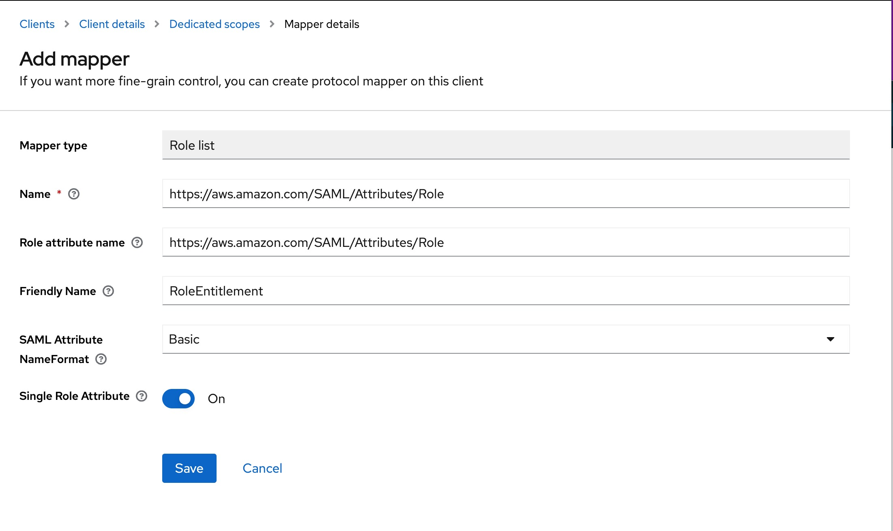

其中 *Role attribute name*，必须是 *https://aws.amazon.com/SAML/Attributes/Role*，它是 AWS 的SAML signin API在 验证 SAML Response 的时候，需要的属性，它的值必须是当前登录的用户的角色列表。通过上面的设置，用户在 Keycloak 登录后，就能将用户在 Keycloak 的角色赋给这个值。

同样的，创建另一个mapper，这个 mapper 的类型是 *User Property*

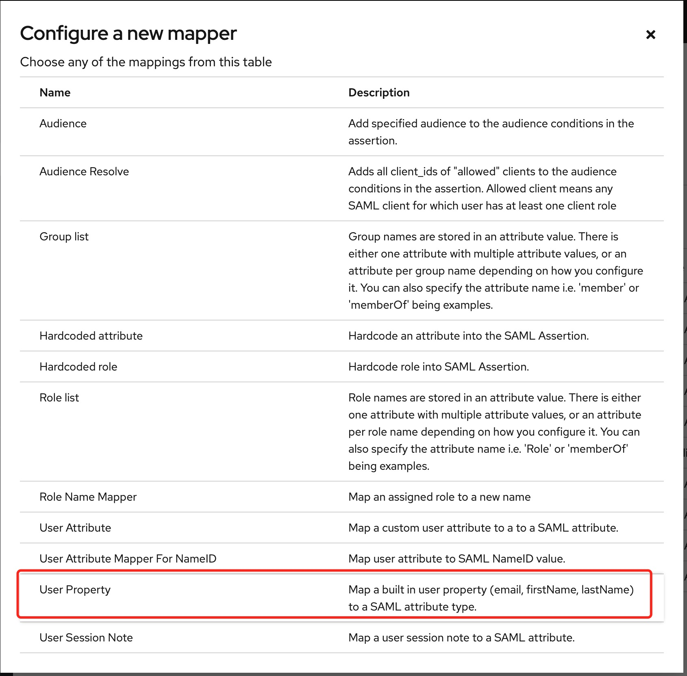

新建的值如下，名称和属性名都是 *https://aws.amazon.com/SAML/Attributes/RoleSessionName*，property 是 *username* ：


通过这个配置，登录的当前用户的用户名，就会被赋给 RoleSessionName。

还有，在创建一个 *Hardcoded attribute* 类型的mapper，来设置 *Session Duration*。这个值要跟 Connect 的 Session 有效期一致，否则可能会出现在 Keycloak 里面 Session 还未过期但是 Connect 里面已经过期的情况。Connect 中登录的用户的 Session 有效期是12小时，所以我们可以设置：


属性名为 *https://aws.amazon.com/SAML/Attributes/SessionDuration*， 值 43000，单位是秒。


最后，在这个 *urn:amazon:webservices* 的 *Dedicated scopes* 页中，进入 *Scope* Tab页，取消 *Full scope allowed* 的勾选，如下：

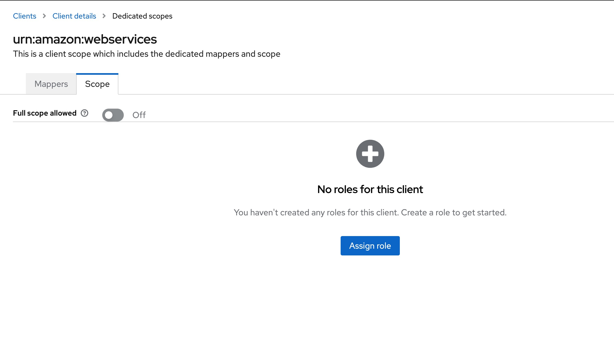

> 如果没有取消这个勾选，这个 Client 中其他默认或内置的角色都会被赋予到角色中，而我们只需要我们刚才创建的 AWS 后台需要的角色。

#### AWS 中设置身份提供商

接下来，需要在 AWS 中添加这个 Keycloak 为身份提供商。

首先，我们需要下载我们安装的 Keycloak 的描述文件，该文件的地址为：

http://localhost:8080/realms/AWSDemo/protocol/saml/descriptor

其中 *localhost:8080* 是我们的 Keycloak 的地址，*AWSDemo* 是我们创建的 Realm 的名称，请根据您的 Keycloak 环境修改地址下载。该文件下载链接也可以从 Realm Setting 页面中的 **Endpoints** 后面的 *SAML 2.0 Identity Provider Metadata* 链接找到。

然后，打开 AWS Console，进入 IAM 服务，进入 Identity providers，点击 *Add Provider* 按钮，进入创建页面，输入名称为 local-keycloak，上传刚才下载的文件，然后添加：

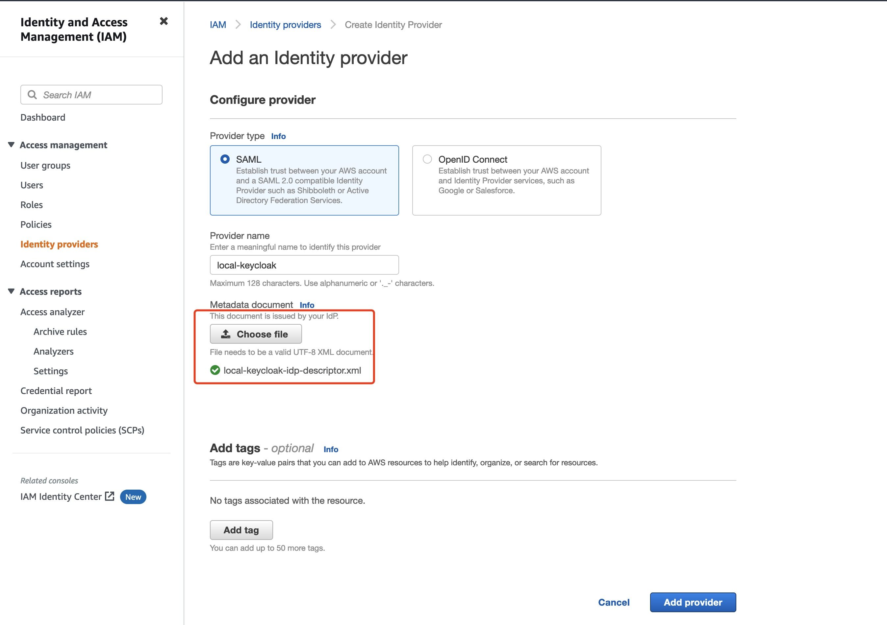

#### 创建 AWS 角色

在 AWS 中，要使用任何的服务，都需要相应的用户或角色。在这里，我们需要创建一个角色，从 Keycloak 登录过来的用户（客服或管理员），给他赋予这个角色，他才能够访问 Connect 服务，然后在 Connect 里面，根据用户应用内的角色进行操作，例如以客服身份接听来电。

在 AWS Console 中，进入 Roles 页面，添加一个新的角色，选择 *SAML 2.0 federation*，在 *SAML 2.0–based provider* 中选择我们创建的 local-keycloak，勾选 *Allow programmatic and AWS Management Console access*，如下图：

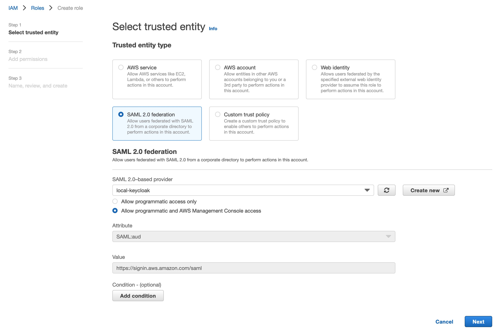

在下一步中，添加权限的页面，点 *Create Policy* 创建一个新的 Policy，Policy 的 JSON 格式的内容如下：
```json
{
    "Version": "2012-10-17",
    "Statement": [
        {
            "Sid": "Statement1",
            "Effect": "Allow",
            "Action": "connect:GetFederationToken",
            "Resource": [
                "arn:aws:connect:ap-northeast-2:56xxxx27:instance/d47fc0b2-83c2-4af9-b78a-6d312739b4a3/user/${aws:userid}"
            ]
        }
    ]
}
```

*Resource* 里面的就是之前创建的 Connect 的实例的 ARN，再加 user后缀，注意使用自己创建的实例 ARN 替换。

然后给这个 Policy 起一个名字，如 *local_keycloak_federation_policy*，然后创建：

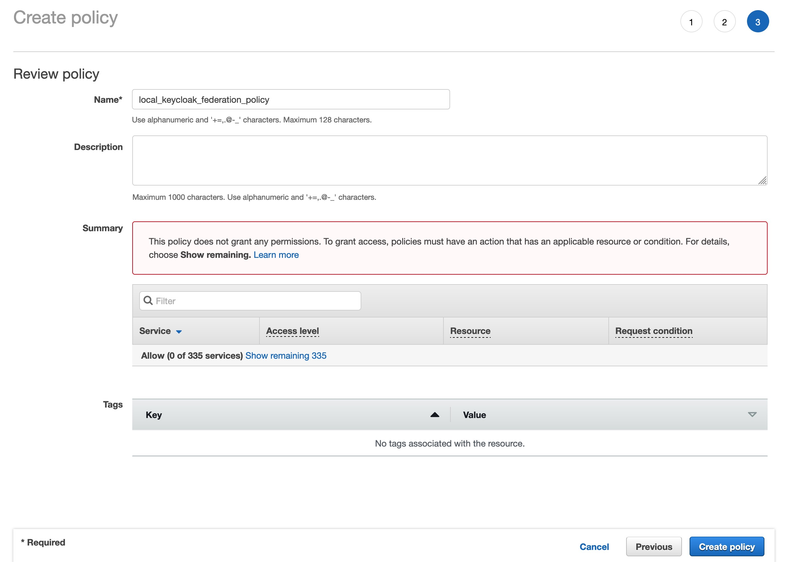

创建完成后，回到创建角色的页面，点击 *Create Policy* 按钮旁边的刷新按钮，然后输入 local_keycloak_federation_policy 就能找到新创建的 Policy，勾选上，给角色的名字设置一个合适的名称，如 *local_keycloak_connect_role*，创建该角色。

如果您有多个 Connect 的实例，想都使用统一的 Keycloak 来实现SSO，那么只需要在这个角色的 Resource 设置多个实例的 ARN 即可，或者使用下面的方式设置条件：
```json
{
    "Version": "2012-10-17",
    "Statement": [
        {
            "Sid": "Statement2",
            "Effect": "Allow",
            "Action": "connect:GetFederationToken",
            "Resource": "*",
            "Condition": {
                "StringEquals": {
                    "connect:InstanceId": [
                    "2fb42df9-78a2-2e74-d572-c8af67ed289b", 
                    "1234567-78a2-2e74-d572-c8af67ed289b"]
                }
            }
        }
    ]
}
```

#### Keycloak 中创建用户、组以及角色

下面，就需要在 Keycloak 中创建用户，客服人员将会使用这些用户来登录 Connect 进行操作。而且，我们还需要在 Keycloak 中创建角色，这个角色将于 AWS 的角色对应，这样登录到 Keycloak 的用户才能在 AWS 的 Connect 上具有权限。

首先建角色，在 Keycloak 中，确认选择合适的 Realm，进入 *Client* 菜单页，进入新建的 *urn:amazon:webservices* 客户端：


新建角色，新角色的名称如下：

*arn:aws:iam::568xxxxxxx27:role/local_keycloak_connect_role,arn:aws:iam::568xxxxxxx27:saml-provider/local-keycloak*

它由两部分组成，中间由逗号隔开，第一部分是创建的 AWS 的角色的 ARN，第二部分是刚创建的 AWS 的身份提供商的 ARN，这些都可以在相应资源的详情页里看到。（注意 568xxxxxxx27 是我的account id，为了安全起见，做了混淆）。

保存后，进入 *Users* 菜单页，点 *Create User* 新建用户：


> 注意这里的用户名必须跟之前在创建 Connect 实例时设置的管理员的用户名必须一致。

创建完成后，进入 *Credentials* Tab 页，给用户设置一个密码， *Temporary* 后面的勾选可以去掉，去掉后用户登录后就不需要强制修改密码了。

然后进入 *Groups* 菜单页，新建一个组，叫 *connect-user-group*，创建后在组详情页中，进入 *Members* Tab 页，将刚才创建的用户 *mavlarn* 加到这个组里：

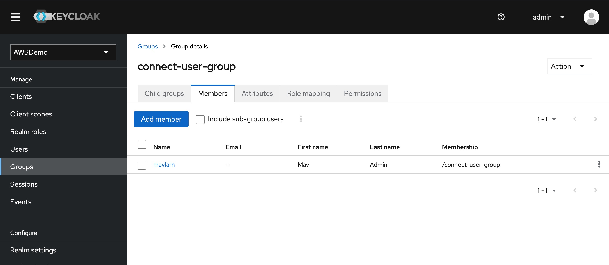

然后进入该组的 *Role mapping* Tab 页，点击 *Assign Role* 按钮，注意这里需要按照 *Filter by clients* 来过滤

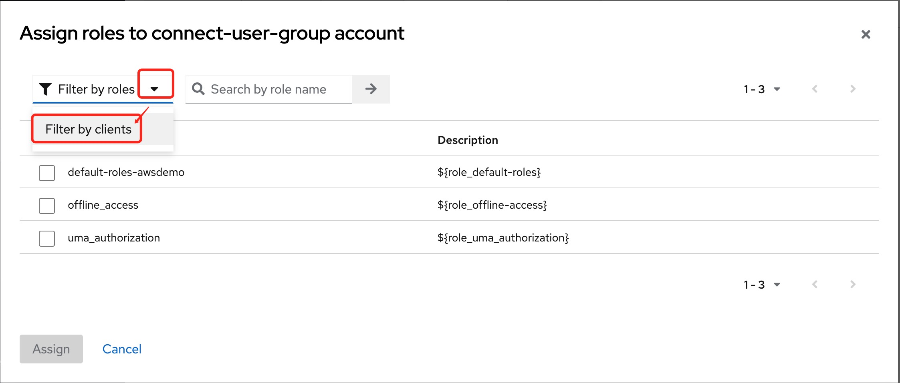

然后找到之前在 Keycloak 里创建的角色（可以输入名称查找，或者翻页）

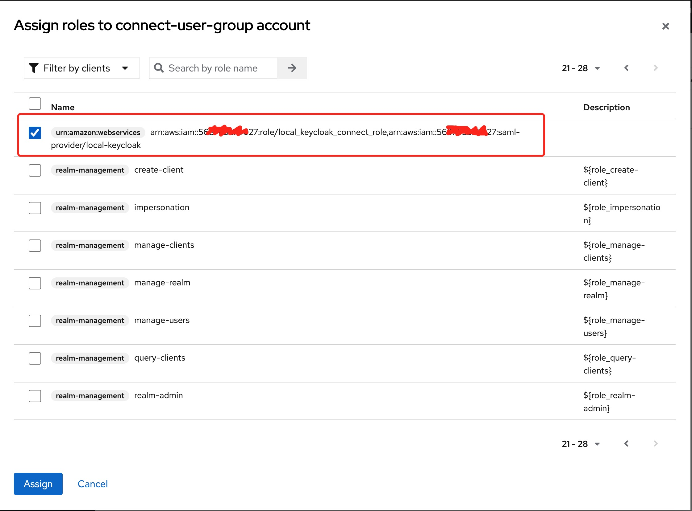

确认后，该组就被赋予这个角色，所有这个组中的成员也都具有这个角色了。而这个角色的命名方式： *<role-arn>,<saml-provdier-arn>* ，也能映射到 AWS 内部的角色，从而让通过 Keycloak 登录的用户能够访问 Connect 服务。

### 测试验证

值此为止，配置已经完成，我们可以访问 *http://localhost:8080/realms/AWSDemo/protocol/saml/clients/aws_connect* ，在弹出的页面输入管理员的用户名（即刚才创建的mavlarn）和密码，成功后就会跳转到 Amazon Connect 页面。其中 *AWSDemo* 是创建的 Realm，*aws_connect* 是我们创建的 Client。

如果想从 Keycloak 退出，可以进入 Account 页面 *http://localhost:8080/realms/AWSDemo/account*， 点击 *Signout* 退出。

### 创建客服用户

至此，我们已经能够用管理员账户通过 Keycloak 登录 Connect。接下来还需要创建其他客服用户。

我们在 Keycloak 中配置了 Client 之后，使用的 Relay State 是 *https://ap-northeast-2.console.aws.amazon.com/connect/federate/d47fc0b2-83c2-4af9-b78a-6d312739b4a3*，这是我们的 Connect 的首页，即 Dashboard 页面。这对于管理员用户是可以的，但是对于普通客服人员，他应该是跳转到客服的工作台页面，这个地址是 *https://ap-northeast-2.console.aws.amazon.com/connect/federate/d47fc0b2-83c2-4af9-b78a-6d312739b4a3?destination=%2Fconnect%2Fccp-v2*。即通过后面的参数 *?destination=%2Fconnect%2Fccp-v2* 来指定要跳转的目的地。

所以，如果我们有自己的工作台和管理界面，可以使用统一的 SAML Client，但是，如果是使用 Connect 内置的工作台，就需要创建第二个 Client，配置跟第一个几乎一样，只是使用不一样的 Relay State 地址。

然后，对于客服的用户，首先我们需要在 Keycloak 中创建这些用户，同时，我们还需要在 Connect 应用的用户管理里面添加这些用户，需要保证使用的用户名是一致。如果没有添加客户用户，或用户名有误，就会出现如下错误：

```log
Access denied
Your account has been authenticated, but has not been onboarded to this application. Contact your Administrator to onboard to Amazon Connect and try again.
```

如果不想每次都在 Connect 中手动添加用户，也可以通过 Connect API 通过 Keycloak 的插件来添加，或者使用 CSV 文件批量的添加。


### Keycoak 可能最在的问题

{}
注意：在当前最新版 **19.0.3** 中，有可能会出现属性 *https://aws.amazon.com/SAML/Attributes/Role* 无法传递到 AWS 进行验证，从而导致出现错误：**Error: Your request included an invalid SAML response. to logout, click here**。出现这个错误就是因为 *https://aws.amazon.com/SAML/Attributes/Role* 或 *https://aws.amazon.com/SAML/Attributes/RoleSessionName* 没有在 SAML Response 里。
如果是因为前者，我们可以通过创建一个 *Hardcoded attribute* 类型的属性，将角色写死在值里，角色值在下面的步骤。这样的话，Keycloak 登录的用户会赋予这个写死的角色来访问 AWS，而不是通过用户组里设置的角色，需要注意。
{}

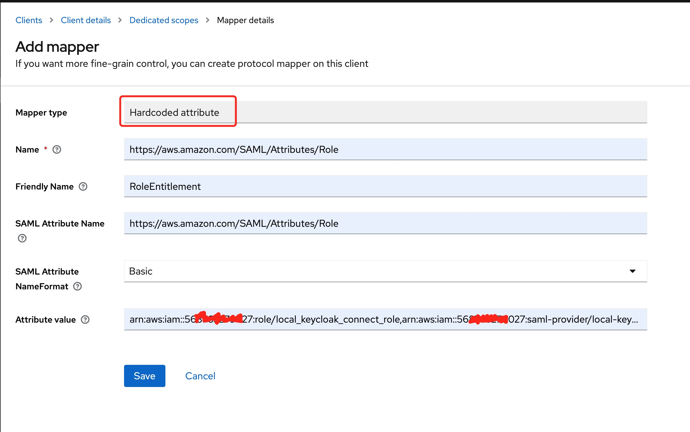

