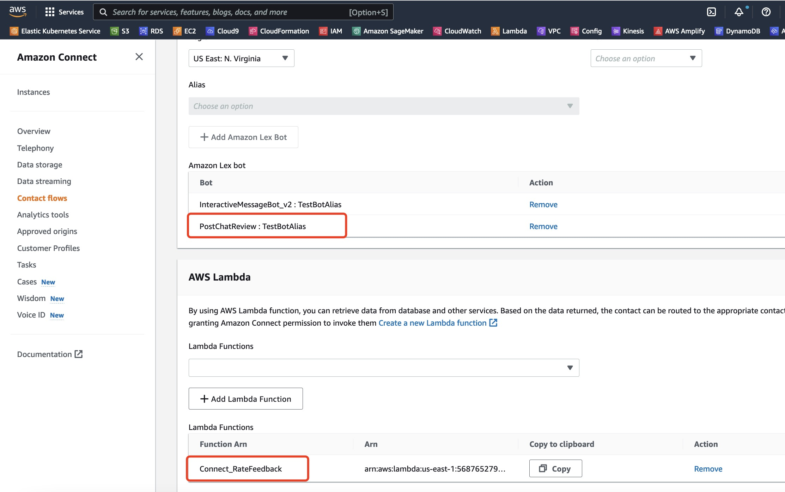

在呼叫中心中，常见的一种使用场景是在客服或者机器人客服完成会话后，提示客户对服务进行评分或评价，以便对客户服务进行评价。在 Amazon Connect 中，我们可以通过 Contact Flow 来实现该功能。

## 实现原理

对客服进行评价，一般是客服人员挂断后，进入另一个流程，提示客户进行评价，客户用语音或键盘输入评价内容或评分后，再挂断电话。

但是，现在除了电话客服，也会越来越多的使用消息客服，例如短信，社交媒体消息，如企业微信、或Facebook Messenger等。在这种消息类型的场景下，流程也是类似的，也是客服人员完成当前会话，这时再进入另一个流程，提示客户评价，处理评价结果，再关闭该会话。

在 Amazon Connect，我们使用一种 *Set disconnect flow* 的 block 类型来实现。当我们给一个流程设置了 *Disconnect flow* 以后，当客服结束会话的时候，就会进入这个 *Disconnect flow* 的流程。这时，客服人员已经退出，他不会再看到客户评价的任何内容。而评价的处理和保存可以通过 LexBot 或者 Lambda 函数来处理。该退出流程如下：


它通过 *Get customer input* block来接受用户输入，再用 *Set Contract attribute* 将用户数据的评分保存在当前会话中，然后使用 *Invoke AWS Lambda function* 调用 Lambda 函数将用户评分保存到数据库中。然后才真正结束该会话。

### Get customer input

Block *Get customer input* 用于接收用户输入，一般用于让当前用户输入密码进行验证，或者提供个人信息用于验证等。所以，这个 Block 不能用于一般的消息类的会话，只能用于语音会话。如果要用于消息类的，则需要通过 LexBot 来使用。也就是在 AWS 中配置 LexBot 接收用户的输入，识别其意图，然后针对识别的意图进行后续处理。所以在这个场景下，为了让我们的流程既能处理语音，也能处理消息，所以就使用了 LexBot。这里的 LexBot 只是提示用户评分，然后将评分结果存到 Slot 中。

### Set Contract attribute

使用 LexBot 识别到客户意图后，我们需要将该意图中 Slot 的值保存到会话中，这样才能供后面的 Lambda 函数使用。所以就需要使用 *Set Contract attribute*。

### Invoke AWS Lambda function

最后，收集到用户评分，就可以通过 Lambda 来处理，不管是保存到数据库，还是通过API发到外部系统，或者是某个 BI，都可以实现。

### LexBot 机器人

通过在 Connect 的流程中使用 Lex 机器人，我们可以实现机器人客服。一个 Lex 机器人（即LexBot），会有一个或多个意图（Intents），意图就是 Lex 机器人根据用户的语音或输入识别到的用户的“意图”，每个意图有可能会slot，用一个对话过程演示他们之间的关系如下：


该机器人定义了一个订花的Intent，当用户输入订花相关的文字时，LexBot 识别到该意图。而这个意图需要几个Slot，如花的类型、包装方式等，LexBot 通过返回相应的提示语，来提示用户输入所需的值。当 LexBot 收集到了足够的信息以后，然后将该意图返回到 Contact 流程的下一步。

## 创建 LexBot

首先，我们创建一个 Lex 机器人。


进入 AWS Console，进入 Lex，新建一个 Bot，选择 *Create a blank bot* ， 名字为 *PostChatReview*，选择角色，Session超时时间默认即可，点下一步。在添加语言页面，选择所需的语言，这里选择英语，然后创建该 Bot。

创建完成后，跳转到新建意图页面。输入名字 *CustomerRate*。

在 *Sample utterances* 中，添加 *ok*， *fine*。

在 Slots 中，添加一个类型为 *AMAZON.Number* ，名称为 *rate* 的slot，该 slot 的提示语是 *Please rate customer service from 1 to 5. 5 is the best.*


在这个 LexBot 中，用户需要输入 *ok* 或 *fine* 来识别该评分的意图，然后 LexBot 发回  *Please rate customer service from 1 to 5. 5 is the best.* 给用户，提示用户评分，Lex 会判断用户的评分必须是数字类型。

然后，在这个 LexBot 之前，我们需要在流程中提示用户 *Would you like you proide feedback to improve our service?* ，来引导用户输入 *ok* 或 *fine*，就能进入上面的意图。

保存意图以后，还需要 Build 才可以使用该意图。如果需要，也可以进入测试页面进行简单测试。

## 创建 Lambda

接下来，我们来实现一个简单的 Lambda，来处理用户的评分。在这里，为了掩饰，我们只是记录日志，如果用户想使用 DynamoDB 来保存用户评分，或者保存到其他的系统，可以自行在 Lambda 中实现。

进入 AWS Lambda 的 Cosole，新建一个 lambda 函数 *Connect_RateFeedback*，内容如下：
```js
exports.handler = async (event) => {
    console.log('event:' + JSON.stringify(event))
    // TODO implement
    const result = { result: 'success' }
    const response = {
        statusCode: 200,
        body: JSON.stringify(result),
    };
    return response;
};
```

## 添加 Lex 和 Lambda 到 Connect 中
创建好了 Lex 和 Lambda 函数以后，我们需要在 Connect 中使用他们，就需要先进入 AWS Console，进入 Connect 的Console，在 *Contact flows* 的配置中添加：



## 添加 Disconnect flow

下面，使用管理员账户进入 Connect 的界面，添加一个 Contact flow。进入 *Contact flows* 的页面，点击新建流程，按照下面的流程创建一个名称为 *Post Chat Feedback* 的 flow：


1. 先通过 *Get customer input* block 接受用户输入：


提示语为 *Would you like you proide feedback to improve our service?*，Lex 的设置就是刚才新建的 Lex 机器人。添加 Intents *CustomerRate*。

2. 再通过 *Set Contract attribute* 将用户数据的评分保存在当前会话中：


它将 Lex 的 slot 中rate的值，保存到 Contact 的属性当中。

3. 然后使用 *Invoke AWS Lambda function* 来处理用户输入的评分。

4. 最后接一个提示，*Thanks for your feedback.*，最后结束这个流程。

完成后，需要保存，并发布该流程。

## 修改 Contact flow

下面，我们就来修改流程，添加客户评分的功能。打开正在使用的流程，比如这里使用的 *Basic Chat*，在流程结束前的某个位置，添加 *Set disconnect flow* 的 block，设置刚才创建的流程。


它告诉 Connect，在流程结束前，先跳转到另一个流程，等那个流程完成了，整个会话才结束。

## 测试

用管理员登录 Connect，从 Dashboard 中点击 “Test chat” 进入测试页面，如果你的默认流程不是刚才修改的流程，还需要修改 *test setting* 设置要测试的流程。

同时，打开 *https://<connect-instance>.my.connect.aws/agent-app-v2/* 以客服账户登录。

从客户测试页面发起会话，然后客服接收。客服点击 *End chat* 结束会话，至此，客服的页面就不会再更新，也看不到客户的评分。

客服结束会话后，客户端看到客服已经离开，就会进入评分的流程，具体流程如下：

