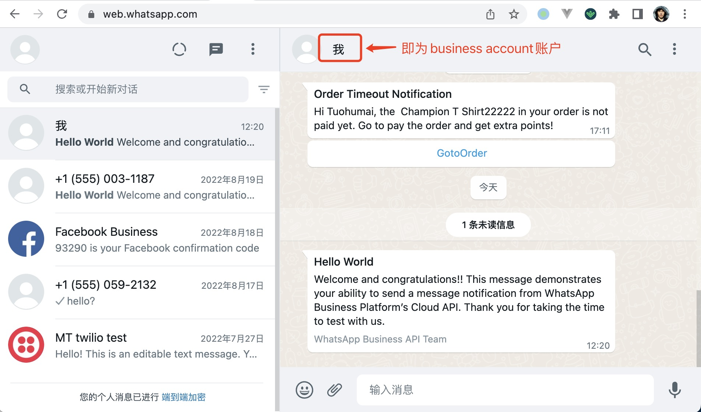
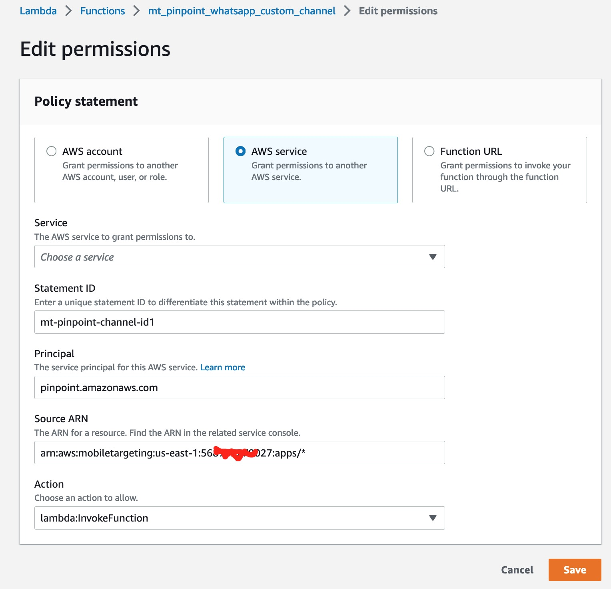

## Amazon Pinpoint 用户触达

Amazon Pinpoint 通常用来通过 SMS 以及邮件的方式来给用户发通知，我们可以创建 Campaign，来动态的给圈选的用户在指定的时间、或某个事件发生的情况下，给用户发送指定模板的消息。更复杂的，我们还可以创建用户旅程的流程，来给用户发消息。

除了 SMS 和邮件，Pinpoint 还提供了 Push-notification，in-app messaging 的消息，我们甚至还可以通过 Lambda 还创建自定义的消息渠道。本文我们就来看一下如何使用 Lambda 创建自定义的渠道（custom channel）并使用它来发送消息给用户。

## 场景描述和前提

本文中，我们希望给用户的 Whatsapp 账号发送消息，实现原理实际上就是在 Lambda 函数内通过调用 Whatsapp 的 API 来发消息。这就需要几个前提：

### 创建并配置 Whatsapp

Whatsapp 是 Facebook 旗下的产品，它提供 Business Platform API，可以用来直接发送 WhatsApp 消息，而无需通过类似 Twilio 这样的服务。开通和配置的过程不是本文的内容，这里就不做说明。我们需要能够通过 API 调用来发消息。配置完成后，可以同下面的页面来测试：


它通过临时的 Token 使用 API 发消息；这里的 *Phone number ID* 是我们的注册的 Business 账号下使用的电话的 Id；*To* 就是我们要发送消息的对象。

发送消息后，我们就可以在网页版的 WhatsApp 应用，或手机应用上看到收到的测试消息。



验证消息接收无误以后，就可以使用 API 调用发送消息了。

### 获取 app token

从上面的测试接口页面，我们可以知道测试接口需要几个参数：

* token： 即 Facebook app token，在 Facebook business platform 创建，需要保证这个token具有 WhatsApp api的权限。
* Phone number ID：即发消息的账号的Id。

### 创建 template

根据 WhatsApp 的机制，我们需要先创建一个消息模板，然后使用该模板发送消息。所以我们需要创建一个 template：


该消息的内容为： *Hi {{1}}, the {{2}} in your order is not paid yet. Go to pay the order and get extra points!*。使用两个变量用来替换消息的内容，实现定制。右侧是消息的展示效果。

## 实现 Lambda

### Pinpoint 消息格式

接下来，我们创建一个 lambda 函数，可以使用 AWS 控制台创建一个空的、NodeJs16 版本 Lambda，index.js 的内容如下：
```javascript
exports.handler = async (event) => {
  console.log('Event', event)

  if (event.Endpoints === undefined) {
    const errorText = 'Unsupported event type. event. Endpoints not defined.'
    console.error(errorText)
    throw new Error(errorText)
  }

  const endpoints = event.Endpoints
  for (var endpointId in endpoints) {
    const endpoint = endpoints[endpointId]
    const phoneId = endpoint.Address
    const customMessage = JSON.parse(event.Data)
    const templateName = customMessage.templateName
    const templateParams = customMessage.params
    await sendWhatsAppTemplateMessage(phoneId, templateName, templateParams)
  }
}
```

这只是一个处理函数，具体发消息的方法下面再说。Pinpoint 使用定制渠道发送消息的时候，消息的格式如下：
```json
{
  "Message":{},
  "Data":"The payload that's provided in the CustomMessage object in MessageConfiguration",
  "ApplicationId":"3a9b1f4e6c764ba7b031e7183example",
  "CampaignId":"13978104ce5d6017c72552257example",
  "TreatmentId":"0",
  "ActivityId":"575cb1929d5ba43e87e2478eeexample",
  "ScheduledTime":"2022-10-08T19:00:16.843Z",
  "Endpoints":{
    "1dbcd396df28ac6cf8c1c2b7fexample":{
      "ChannelType":"EMAIL",
      "Address":"mary.major@example.com",
      "EndpointStatus":"ACTIVE",
      "OptOut":"NONE",
      "Location":{
        "City":"Seattle",
        "Country":"USA"
      },
      "Demographic":{
        "Make":"OnePlus",
        "Platform":"android"
      },
      "EffectiveDate":"2022-10-01T01:05:17.267Z",
      "Attributes":{
        "CohortId":[
          "42"
        ]
      },
      "CreationDate":"2022-10-01T01:05:17.267Z"
    }
  }
}
```
每个事件参数中会有一个 *Endpoints* 的对象，它保存要发送消息的目标端点，其中 key 就是 *EndpointId*，值就是这个端点的详情，在这个消息内容中，它使用 Email 发消息，目标地址是 *mary.major@example.com*。在本实例中，我们要发送 WhatsApp 消息，所以我们会给用户创建一个 *WhatsApp* 类型的 *Endpoint*，而它的 address 就是 WhatsApp 的手机号。

### 传递消息参数

在使用 Pinpoint 发消息时，定制消息的内容放在 *event.Data* 中，而在这个数据中，我们将模板名和数据都放在这里，这样我们就可以使用同一个 Lambda 的函数，发送多种模板类型的消息。

```js
    const customMessage = JSON.parse(event.Data)
    const templateName = customMessage.templateName
    const templateParams = customMessage.params
```

### 保存 Facebook token 和 Phone number ID

还有，我们要掉用 Facebook 的 API，还需要使用 token，而这个 token 一般都需要加密保存，所以我们使用 AWS 的 *Secret Manager* 服务，创建一个加密的对象来存储，然后在 Lambda 函数中获取这个值，这样就能安全的使用这个token。

所以，我们打开 Secret Manager Console 界面，*Store a new secret*，选择 *Other type of secret*，以 *FB_APP_TOKEN* 为 key（在代码中要使用这个key来获取token），值就是 Facebook 里面的 token。


保存之后，我们需要在 Lambda 中得到这个 token 的值，通常的做法是在 Lambda 中创建一个环境变量，将刚才在 Secret Manager 里创建的安全对象的 ARN 值设置到这个环境变量的值。

所以我们打开 Lambda 的配置界面，按如下方式配置环境变量。


由于我们在 lambda 中使用这个环境变量的 key 来获取他的值，所以需要使用 *FB_BUSINESS_PHONE_ID* 和 *FB_SECRET_ARN* 作为key。

### index.js 完整代码

下面，就是js中所有的代码，包括处理人口以及发送 WhatsApp 消息的代码：
```js
onst https = require('https')
const AWS = require('aws-sdk')

const BUSINESS_PHONE_ID = process.env.FB_BUSINESS_PHONE_ID

const PATH_WHATSAPP = '/v14.0/' + BUSINESS_PHONE_ID + '/messages'
let appToken

const secretManager = new AWS.SecretsManager()

const sendWhatsAppTemplateMessage = async (phoneId, templateName, templateParams) => {

  if (appToken === undefined) {
    await getFacebookSecrets()
  }
  
  const body = {
    messaging_product: 'whatsapp',
    recipient_type: 'individual',
    to: phoneId,
    type: 'template',
    template: {
      name: templateName,
      language: { code: "en_US" },
      components: templateParams
    }
  }
  console.log('Send FB WhatsApp body', body)
  const headers = {
    Authorization: 'Bearer ' + appToken,
    'Content-Type': 'application/json'
  }

  const options = {
    host: 'graph.facebook.com',
    path: PATH_WHATSAPP,
    method: 'POST',
    headers
  }

  const result = await new Promise((resolve, reject) => {
    const req = https.request(options, (res) => {
      let responseBody = ''
      res.on('data', (chunk) => {
        responseBody += chunk
      })

      res.on('end', () => {
        resolve(responseBody)
      })
    })

    req.on('error', (err) => {
      console.error('Error sending FB WhatsApp message', err)
      reject(err)
    })

    req.write(JSON.stringify(body))
    req.end()
  })

  const resultObj = JSON.parse(result)
  console.log('Send FB WhatsApp Message result', result)

  if (resultObj.error !== undefined) {
    console.error('Error sending FB WhatsApp message', resultObj)
    return false
  }
  return true
}

const getFacebookSecrets = async () => {
  if (process.env.FB_SECRET_ARN) {
    const params = {
      SecretId: process.env.FB_SECRET_ARN
    }
    const response = await secretManager.getSecretValue(params).promise()
    const sec = JSON.parse(response.SecretString)
    appToken = sec.FB_APP_TOKEN
  } else {
    appToken = null
  }
}

exports.handler = async (event) => {
  console.log('Event', event)

  if (event.Endpoints === undefined) {
    const errorText = 'Unsupported event type. event. Endpoints not defined.'
    console.error(errorText)
    throw new Error(errorText)
  }

  const endpoints = event.Endpoints
  for (var endpointId in endpoints) {
    const endpoint = endpoints[endpointId]
    const phoneId = endpoint.Address
    const customMessage = JSON.parse(event.Data)
    const templateName = customMessage.templateName
    const templateParams = customMessage.params
    await sendWhatsAppTemplateMessage(phoneId, templateName, templateParams)
  }
}
```

### 创建 pinpoint app 和 Endpoint

为了测试，我们还需要在 Pinpoint 中创建一个项目，并记录下项目的 Id 备用。然后还需要一个Endpoint，由于我们需要一个 WhatsApp 类型的，这是一个自定义的 Channel 类型，系统中肯定不会有现成的 Endpoint，所以我们使用 aws cli 工具创建一个。

首先创建一个 *test-endpoint.json* 文件，内容如下：
```json
{
  "ChannelType": "CUSTOM",
  "Address": "8613800138000",
  "Attributes": {
    "Interests": [
      "Technology",
      "Music",
      "Travel"
    ]
  },
  "Metrics": {
    "technology_interest_level": 9.0,
    "music_interest_level": 6.0,
    "travel_interest_level": 4.0
  }
}
```
其中，Address 就是你要测试使用的手机号，需要在前面加上国家码（即86）。

然后使用 AWS Cli 工具运行：
```bash
aws pinpoint update-endpoint --application-id f190affea10b4ce2b4a2cbbd85976c96 --profile MTProj --endpoint-
id test123 --endpoint-request file://test-endpoint.json
```

其中，*--application-id* 后面是之前创建的pinpoint项目的id，*--profile* 是我自己使用的认证方式。执行后，成功的话，就会返回新建的 Endpoint id：
```json
{
    "MessageBody": {
        "Message": "Accepted",
        "RequestID": "b6e9a334-0d51-4b5e-9b87-4aecaad7c966"
    }
}
```
也可以通过命令获得endpoint信息：
```bash
aws pinpoint get-endpoint --application-id f190affea10b4ce2b4a2cbbd85976c96  --endpoint-id test123 --profile MTProj
```

### 设置权限

最后，我们还需要合适的权限才能使用这个定制的渠道。

首先，我们需要知道它的调用逻辑，才能知道*谁*需要*什么*权限，来访问*谁*。在发送定制渠道的消息时，我们通过 API 创建一个 campaign 活动，在 campaign 里面创建一个动态的 Segment；它在执行的时候，会掉用 lambda 函数，而这个 Lambda 函数在执行的时候，又需要从 Secret Manager 读取 Token，所以它的调用关系如下：

pinpoint应用 -> lambda 函数 -> Secret Manager 对象。我们通过给这个 Lambda 函数设置一个 *Resource Policy*，来允许 Pinpoint 应用可以调用它，然后再给这个 Lambda 的role设置权限，让它能够访问 Secret Manager。

所以，先打开刚才创建的 Lambda 函数配置页面的 Permission 页：


在 Resource based policy的部分，添加一条permission：



选择 AWS service，选择 Other，然后手动输入，其中 Principal 输入 *pinpoint.amazonaws.com*，Source ARN 填你创建的 Pinpoint 项目的 ARN，我这里最后用星号（\*），表示我所有的Pinpoint项目都能调用这个 Lambda 。然后选择Action 为 *lambda:InvokeFunction*。

然后，找到这个 Lambda 函数使用的角色，为这个角色添加Policy，来让它能够访问 Secret Manager。在角色的Permission页面，添加一个 Inline Policy，策略内容如下：


```json
{
    "Version": "2012-10-17",
    "Statement": [
        {
            "Action": "secretsmanager:GetSecretValue",
            "Resource": "arn:aws:secretsmanager:us-east-1:56xxxxxx027:secret:connect/facebook-S5G08O",
            "Effect": "Allow"
        }
    ]
}
```

Resource 的值就是我们之前在 Secret Manager 里创建的对象的 arn。

## 通过 Console 创建 Campaign 测试

最后，我们在 Pinpoint 的console 页面，进入之前的项目，创建一个 Campaign 来测试这个新渠道消息。创建的时候，创建 Segment 的时候，我们需要创建一个 Segment，条件设置 Channel Type 为 custom，下面会出来预估的当前这个 Segment 条件下大概会有多少个Endpoint 会被触达。我们这里的测试环境只有一个 CUSTOM 类型的 Endpoint，所以只有1.


下一步，我们需要选择之前创建的 Lambda 函数，以及使用过 *custom* 类型的Endpoints。


然后下一步，选择立即开始，并最后保存这个 Campaign。

创建完成后，就会跳转到详情页，这个页面中，会展示这个活动圈选了几个 Endpoint，并触达了几个 Endpoint（这里的*触达*只是表示掉用了 Lambda 函数，至于 Lambda 函数是否成功执行，这里无法体现）。

{}
注意：我们发送 Whatsapp 消息，使用定制的消息模板，并且模板中还使用变量，而这些变量，也需要通过 Campaign 传递到 Lambda 函数，然后在 API 中使用。
但是，我们使用 Console 进行测试的时候，并没有传递任何参数，所以，实际上，我们通过 Console 测试的时候，Lambda 函数会执行失败，因为没有 *event.Data* 数据。所以，我们需要通过 API 调用的方式，才能测试带自定义内容的消息。
{}

## 通过 API 测试

最后，我们来看一下使用过 JS sdk进行API调用的实例：
```js
  const ppClient = new PinpointClient({
    region: "us-east-1",
    credentials: fromCognitoIdentityPool({
      identityPoolId: <the_identityPoolId>,
      client: new CognitoIdentityClient({ region: 'us-east-1' })
    })
  });
  
  const dataObj = [
    {
        "type": "body",
        "parameters": [
        {"type": "text", "text": "Tuohumai"},
        {"type": "text", "text": " Champion T Shirt"}
        ]
    },
    { 
        "type": "button",
        "sub_type": "quick_reply",
        "index": "0",
        "parameters": [
        { "type": "payload", "payload": "button 0 clicked" }
        ]
    }
  ]

  const customMessage = { templateName: 'ordertimeoutnotification', params: dataObj }
  const command = new CreateCampaignCommand({
    ApplicationId: 'f190affea10b4ce2b4a2cbbd85976c96',
    WriteCampaignRequest: {
      Name: 'test-campaign-wa-message-with-api',
      Description: 'campaign Desc',
      SegmentId: 'b5b50ccb81644a3390751ee1e4fe27ac',
      Schedule: {
        StartTime: "IMMEDIATE"
      },
      MessageConfiguration: {
        CustomMessage: {
          Data: JSON.stringify(customMessage),
        }
      },
      CustomDeliveryConfiguration: {
        DeliveryUri: 'arn:aws:lambda:us-east-1:568xxxxxx9027:function:mt_pinpoint_whatsapp_custom_channel',
        EndpointTypes: ["CUSTOM"]
      }
    }
  });
  const response = await ppClient.send(command);
  console.log("Success", response);
```

在这个代码中，我们先创建了自定义消息所需的参数 *dataObj*，它跟我们在 WhatsApp 中创建的消息有关，它包括消息内容中要替换的变量 *parameters*，也有 Whatsapp 里面展示时添加的按钮，以及这个按钮的动作，这都是 WhatsApp 消息所需的内容，跟接口无关。然后我们将这个对象转成 String 以后，放到 *MessageConfiguration.CustomMessage.Data* 中。

*WriteCampaignRequest* 是使用接口创建 Campaign 的对象。通过这个接口，就可以创建一个立即运行的 Campaign，这样就能在 WhatsApp 应用中看到通知的消息了。