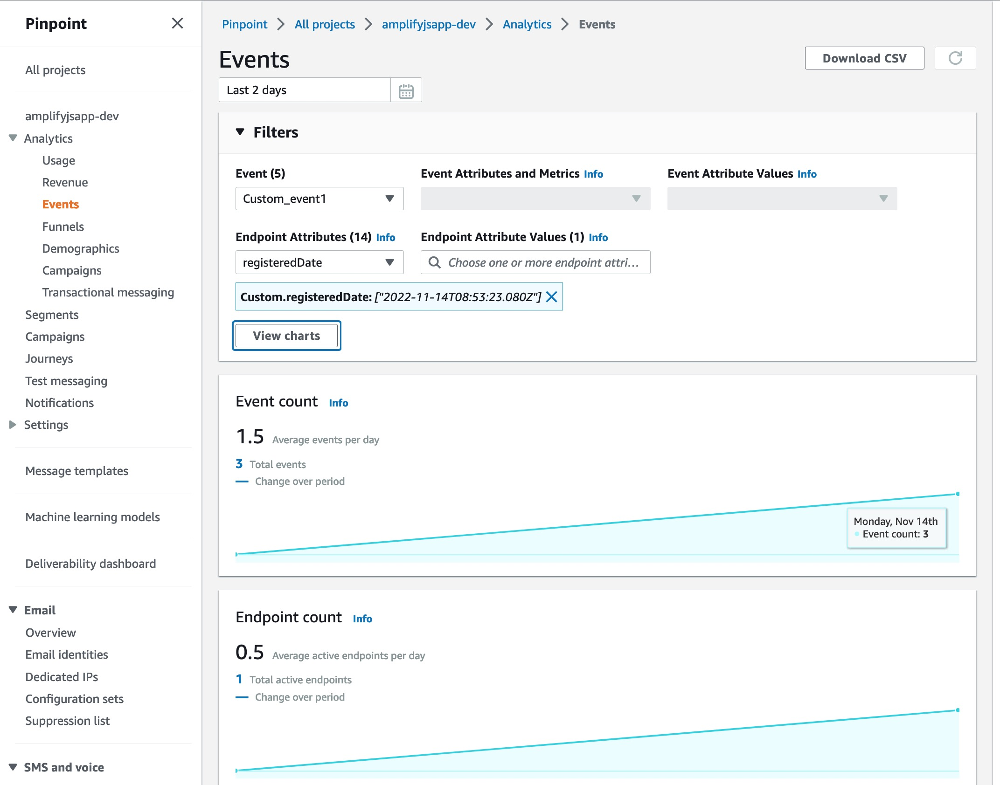
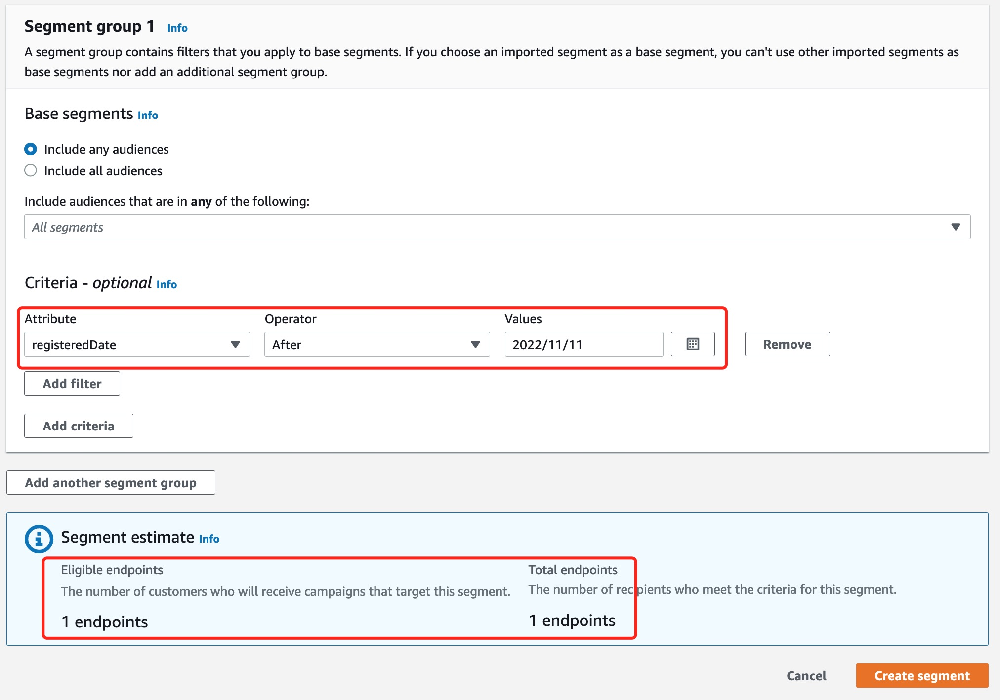

## Amazon Pinpoint 用户行为分析

Amazon Pinpoint 的其中一个功能是收集客户端的用户行为，并发送到 AWS Pinpoint 服务中进行汇总分析，并结合动态 Segment 实现用户圈选，以及出发用户旅程（Journey），从而实现自动化的营销功能。

## Pinpoint Analytics 使用

要使用 Pinpoint Analytics 的用户行为分析功能，我们需要在前端页面或者 App 中，使用相应的 JS 库注册当前用户，并对用户的行为埋点，即记录用户事件。我们有两种方式来使用 JS 库实现埋点。

1. 使用 [Pinpoint JS Sdk](https://docs.aws.amazon.com/AWSJavaScriptSDK/latest/AWS/Pinpoint.html)。这种方式跟大部分 JS 库的使用类似，就是引入该JS库，在 JS 中初始化 Pinpoint Client，初始化时需要传递认证信息。这样就能在页面中通过 JS 库调用 Pinpoint 的 API 实现各种功能，包括记录事件、创建Segment、Campaign等。
2. 使用 [Amplify 工具](https://docs.amplify.aws/)。Amplify 是一系列命令行工具和 JS 库的集合。使用 Amplify，我们可以通过命令行来给我们现有的前端应用添加 AWS 服务，并通过提供的 Amplify 库与后端的 AWS 服务进行交互。例如访问后端的 S3 文件存储服务，DynamoDB 数据库，API Gateway 等等。

在本文中，我们就介绍如何使用 Amplify 来为我们的前端应用 添加用户分析的功能，并通过用户属性和 Pinpoint 的 Segment 功能，实现动态圈选用户。

## 实现

### 场景介绍和前提

本文中，假设我们有一个前端页面是纯 JS 的应用，比如只使用了 JQuery 之类的库实现了前端交互。同时，这样的前端应用往往不会使用 NPM 这样的JS 库依赖管理功能，所以我们希望将 JS 库以及 初始化的方法打包好，在每个页面的 *script* 标签中引入这个包，然后使用 Pinpoint Analytics 的方法来记录事件。

>如果您的前端应用使用了 Vue、Angular 或 React 等框架，可以参考 [Amplify 在线文档](https://docs.amplify.aws/) 中的说明。

### 初始化 Amplify 应用

首先，在现有的前端应用的根目录，运行下面的命令初始化 Amplify。（有关 Amplify 工具的安装和设置，请参考[官方文档](https://docs.amplify.aws/start/getting-started/installation/q/integration/js/)）

```bash
amplify-js-app % amplify init
```
将看到如下的日志：

```bash
Note: It is recommended to run this command from the root of your app directory
? Enter a name for the project amplifyjsapp
The following configuration will be applied:

Project information
| Name: amplifyjsapp
| Environment: dev
| Default editor: Visual Studio Code
| App type: javascript
| Javascript framework: none
| Source Directory Path: src
| Distribution Directory Path: dist
| Build Command: npm run-script build
| Start Command: npm run-script start

? Initialize the project with the above configuration? Yes
Using default provider  awscloudformation
? Select the authentication method you want to use: AWS profile

For more information on AWS Profiles, see:
https://docs.aws.amazon.com/cli/latest/userguide/cli-configure-profiles.html

? Please choose the profile you want to use MTProj
Adding backend environment dev to AWS Amplify app: d39nrrswky58lm
⠴ Initializing project in the cloud...

CREATE_IN_PROGRESS amplify-amplifyjsapp-dev-133145 AWS::CloudFormation::Stack Mon Nov 14 2022 13:31:50 GMT+0800 (GMT+08:00) User Initiated
CREATE_IN_PROGRESS DeploymentBucket                AWS::S3::Bucket            Mon Nov 14 2022 13:31:54 GMT+0800 (GMT+08:00)
CREATE_IN_PROGRESS AuthRole                        AWS::IAM::Role             Mon Nov 14 2022 13:31:55 GMT+0800 (GMT+08:00)
CREATE_IN_PROGRESS UnauthRole                      AWS::IAM::Role             Mon Nov 14 2022 13:31:55 GMT+0800 (GMT+08:00)
CREATE_IN_PROGRESS AuthRole                        AWS::IAM::Role             Mon Nov 14 2022 13:31:56 GMT+0800 (GMT+08:00) Resource creation Initiated
CREATE_IN_PROGRESS DeploymentBucket                AWS::S3::Bucket            Mon Nov 14 2022 13:31:56 GMT+0800 (GMT+08:00) Resource creation Initiated
CREATE_IN_PROGRESS UnauthRole                      AWS::IAM::Role             Mon Nov 14 2022 13:31:56 GMT+0800 (GMT+08:00) Resource creation Initiated
⠇ Initializing project in the cloud...

CREATE_COMPLETE AuthRole   AWS::IAM::Role Mon Nov 14 2022 13:32:13 GMT+0800 (GMT+08:00)
CREATE_COMPLETE UnauthRole AWS::IAM::Role Mon Nov 14 2022 13:32:14 GMT+0800 (GMT+08:00)
⠧ Initializing project in the cloud...

CREATE_COMPLETE DeploymentBucket AWS::S3::Bucket Mon Nov 14 2022 13:32:17 GMT+0800 (GMT+08:00)
⠧ Initializing project in the cloud...

CREATE_COMPLETE amplify-amplifyjsapp-dev-133145 AWS::CloudFormation::Stack Mon Nov 14 2022 13:32:19 GMT+0800 (GMT+08:00)
✔ Successfully created initial AWS cloud resources for deployments.
✔ Help improve Amplify CLI by sharing non sensitive configurations on failures (y/N) · no
✔ Initialized provider successfully.
✅ Initialized your environment successfully.

Your project has been successfully initialized and connected to the cloud!
```

成功执行以后，它将在 AWS 创建几个角色，AuthRole 和 UnauthRole，用于已登陆的用户和匿名用户通过 *Cognito Identity Pool* 来访问 AWS 后端服务。

### 添加 analytics 服务

然后，我们将添加 Pinpoint analytics 服务。在根目录运行下面的命令：
```bash
amplify add analytics
```
它将提示我们创建一个 Pinpoint 的项目，我们需要提供一个项目名称。执行完成后，我们再运行
```bash
amplify push
```
运行 Push 以后，Amplify将会为我们生成 CloudFormation 文件，并用该文件创建后台的 Pinpoint 资源。

如果我们已经创建好了 Pinpoint 的项目，想使用现有的项目的话，可以忽略 *add analytics* 的步骤，直接 *push* 即可，之后可以通过修改 json 配置来使用现有的 Pinpoint 项目。

### 检查生成的 json 文件

通过 Amplify 工具添加服务之后，它通过 CloudFormation 来为我们创建 AWS 资源，然后将创建的资源的 id 等信息保存在 *aws-exports.js* 文件中。

运行上面的 *add analytics* 和 *push* 之后，它的内容如下：（在这个文件中，我们需要的主要是三个配置）
```js
const awsmobile = {
    "aws_project_region": "us-east-1",
    "aws_cognito_identity_pool_id": "us-east-1:c923c1f1-285a-4b1d-acad-c19c61c2287f",
    "aws_mobile_analytics_app_id": "1e4f01b0a02c495d96c9c8410eac246e"
};
export default awsmobile;
```

其中，*aws_cognito_identity_pool_id* 是 Amplify 为我们创建的 identity pool 的 ID，*aws_mobile_analytics_app_id* 是 Amplify 为我们创建的项目的 ID。

如果要使用现有的 Pinpoint 项目，甚至现有的 *Cognito Identity Pool*，可以修改这个文件，使用现有资源的 ID 即可。

### 初始化 Amplify Analytics

在[官方文档](https://docs.amplify.aws/start/getting-started/setup/q/integration/js/)中，使用 NPM 引入 *aws-amplify*  库，并使用 *Webpack* 进行打包。但是在我们本实例中，假设用户并没有使用 NPM 管理依赖。所以，我们的方法大致如下：
1. 创建一个临时的js应用，按照官方文档的方式加载 amplify 库
2. 在 app.js 中初始化我们的 Pinpoint Analytics 服务
3. 使用 Webpack 将js文件打包成一个 bundle.js 文件
4. 在真实项目的html页面中，引入该 bundle 文件，并通过 script 脚本在需要在页面或按钮上记录事件。

所以，我们的 app.js 文件代码如下：
```js
import { Amplify, Analytics, Auth } from "aws-amplify";
import awsExports from './aws-exports'

Amplify.Logger.LOG_LEVEL = 'DEBUG' // 开启debug，生产环境建议删掉这一行
const config = {
  Auth: {
    region: awsExports.aws_project_region,
    identityPoolId: awsExports.aws_cognito_identity_pool_id
  },
  Analytics: {
    // OPTIONAL - disable Analytics if true
    disabled: false,
    // OPTIONAL - Allow recording session events. Default is true.
    autoSessionRecord: true,

    AWSPinpoint: {
      appId: awsExports.aws_mobile_analytics_app_id,
      region: awsExports.aws_project_region,
      mandatorySignIn: false,
      // endpointId: '1234',
      endpoint: {
        address: 'aws-amplify-jsapp-123', // 只有 SMS、Email中有意义
        attributes: {
          hobbies: ['piano', 'hiking'] // 用户在该通道的属性
        },
        channelType: 'IN_APP', // 渠道类型，如果要通知，则需要设置相应类型
        metrics: {
          // Custom metrics that your app reports to Amazon Pinpoint.
          age: 39
        },
        optOut: 'NONE',
        // Customized userId，一个用户可以有多个 endpoint
        userId: 'mav_123',
        // User attributes
        userAttributes: {
          interests: ['football', 'basketball', 'AWS'],
          FirstName: ['Mavlarn']
        }
      }
    }
  }
}
Amplify.configure(config);
const currentAuthConfig = Auth.configure();
console.log('amplify auth config:', JSON.stringify(currentAuthConfig))

// 将这两对象放在window，可以作为全局对象使用，而无需通过 import。
window.Amplify = Amplify
window.Analytics = Analytics
```

其他的代码都跟上面的文档中一样，然后运行 *npm dev*，就可以编译生成 bundle js文件在 dist 目录中，我们就可以在其他页面引入这个文件，并记录事件：
```html
<!DOCTYPE html>
<html lang="en">
  <head>
    <meta charset="utf-8" />
    <title>Amplify Demo</title>
    <meta name="viewport" content="width=device-width, initial-scale=1" />
  </head>

  <body>
    <div class="app">
      <div class="app-header">
        <button onclick="recordEvent()">Record Event</button>
      </div>
    </div>
    <script src="main.bundle.js"></script>
    <script>
      function recordEvent() {
        Analytics.record({ name: 'Custom_event' });
      }
    </script>
  </body>
</html>
```

提供的现成的 js 项目，可以参考 [Github](https://github.com/Mavlarn/pinpoint-amplify-js-app)。读者可以直接从这个实例心目中的 dist 文件中找到已经打包好的 hundle.js 文件，然后修改其中的 aws_mobile_analytics_app_id 等配置来直接使用。

## 检查 Pinpoint

### 检查 Pinpoint 事件

在页面点击按钮记录事件，或者更新 Endpoint 属性之后，我们就可以在 AWS Pinpoint 的 Console 中查看记录的事件。打开 Console，进入 Pinpoint 服务，在项目列表中找到并点击创建的项目，这里是 *amplifyjsapp-dev*。在左侧菜单中找到 Analytics - Events，就可以看到统计的 Event 信息。

>如果想要得到所有事件的明细，可以通过[设置 Kinesis Stream 将事件流写到 Kinesis 中然后自行处理](https://docs.amplify.aws/lib/analytics/streaming/q/platform/js/)， 或者 [使用 Kinesis Firehose 将事件写到 S3 或其他位置](https://docs.amplify.aws/lib/analytics/storing/q/platform/js/#installation-and-configuration)。

打开 Event 试图，就能够看到事件统计。


默认我们只能按天查看事件的汇总图标，我们可以启用 *Filters* 功能，来按照事件类型、属性来进行搜索和过滤。例如这里，我们在页面中记录了自定义事件 *Custm_event1*，我们就可以按这个事件来查看每天的事件数量。也可以按照该事件的属性（如果有的话），或者按照 Endpoint 的属性来进行过滤。

### 创建动态 Segment

我们在实例中，通过 *updateEndpoint* 更新了Endpoint 的属性值，也可以更新用户的属性，或者 Metrics，这些都能用来作为创建动态 Segment 的条件。
```js
Analytics.updateEndpoint({
    attributes: {
        registeredDate: [new Date()]
    },
    userAttributes: {
        lastOrderProducts: ['football', 'iphone', 'TV'],
        userType: ['vip']
    },
    metrics: {
        age: 35
    }
})
```

然后就可以在创建 Segment 的时候，使用这些属性来动态创建 Segment，按需选出想要的用户：


这里，我们使用用户的注册时间晚于11月11号这天作为条件，选出了刚才的实例中测试的那个用户的 Endpoint，这样就可以结合 Campaign 或 Journey 进行其他的自定义的触达活动。

